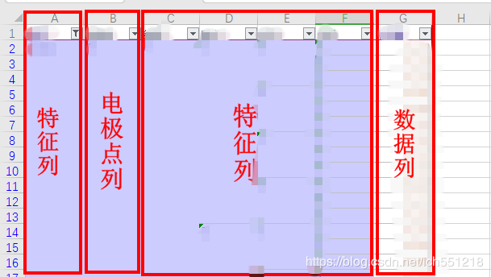
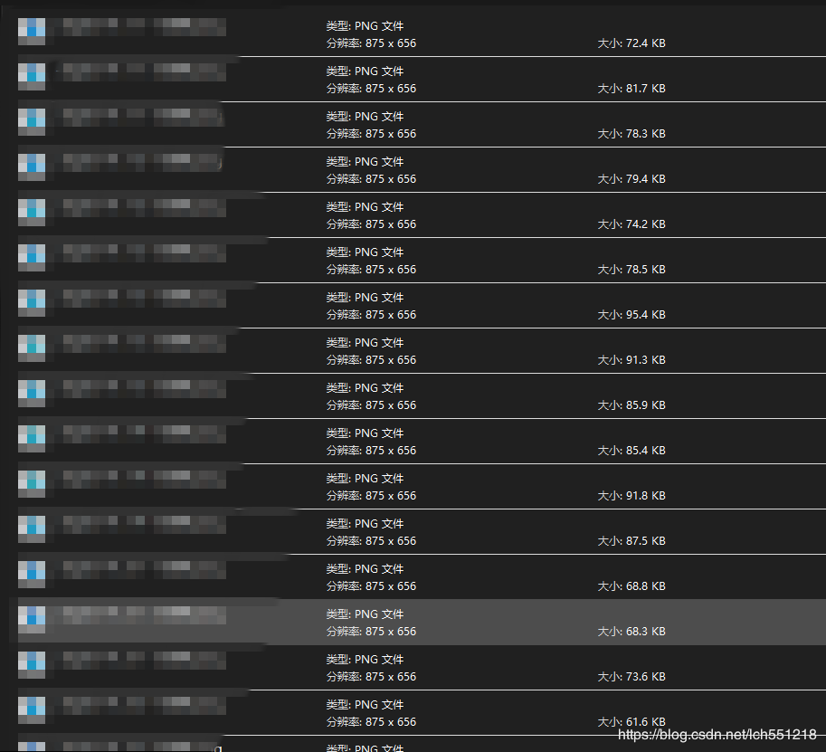

# eeglabplot

## 简介
调用egglab实现批量绘制脑电拓扑图
使用**topoplot**函数可以轻松实现在matlab的fgure中绘制脑电拓扑图，但对于大量数据，如果每次都手动调用topoplot绘制单张拓扑图片，将会消耗大量时间和精力，这里手写了一个matlab脚本读取存放在excel文件中的**批量数据**并实现**批量绘图**。
## 1.数据源的存储结构
数据源为excel文件，excel文件内的数据截图如下： 

 

数据基本分为三个部分:特征列，数据列和电极点列，其中： 

1. 特征列：代表数据的一个特征， 
2. 电极点列：表示测量数据所在的电极点位置 
3. 数据列：存储脑电强度数据 

## 2.输入参数
算法前几行为输入参数： 

|参数名称|参数说明  |
|--|--|
| featurecol | 所选特征列在excel文件中的列标（数组） |
| datacol | 数据列的列标（数组） |
| loccol | 电极点数据在excel文件中的列标（int） |
| boundlimitcol | 根据此列数据进行分组并计算每组的最大值和最小值，绘图时为同组的数据分配相同的上小限（int） |

## 3.输出结构
算法会根据输入的excel文件名，在源文件目录下创建一个同名文件夹（这里称之为一级目录）；在此文件夹下，算法会根据数据列数组的名称，继续创建和数据列数量相同的同名文件夹，（这里称之为二级目录）；最后，算法会在多个二级目录下，生成对应的脑电拓扑图，同时算法用“-”将每条数据的特征连接起来作为每个图片的文件名。输出文件的树形结构如下：

	|--data.xlsx（源文件）
	|--data（一级目录）
		|--------数据列1（二级目录）
			|---------------------文件1.png
			|---------------------文件1.png
			|---------------------文件1.png
			|...
			|---------------------文件n.png
		|--------数据列2（二级目录）
		...
	...	

算法生成的图片截图如下：

 
## 4.依赖文件
运行此代码需要用到topoplot、chanlocsseek、cbar.m和chanlocsposi.mat文件，
